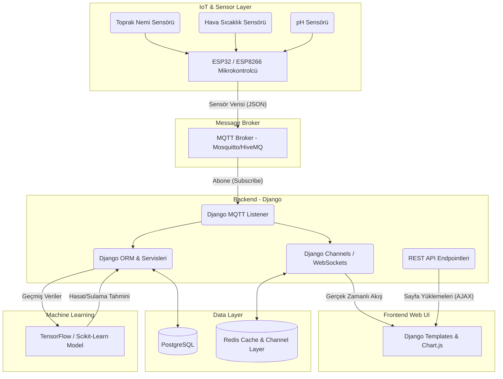

# Akıllı Tarım Yönetim Sistemi - Sistem Mimarisi ve Gereksinimler

Bu doküman, sistemin uçtan uca mimarisini ve projeye ait fonksiyonel / fonksiyonel olmayan gereksinimleri detaylandırmaktadır. Bu içeriği doğrudan GitHub Wiki sayfanıza kopyalayarak kullanabilirsiniz. (GitHub, Mermaid diyagramlarını doğrudan destekler.)

## Sistem Mimarisi

Aşağıdaki diyagram, sistemin donanım katmanından son kullanıcı arayüzüne kadar olan veri akışını ve teknoloji yığınını göstermektedir.

---

## Gereksinimler (Requirements)

### 1. Fonksiyonel Gereksinimler (Functional Requirements)

Fonksiyonel gereksinimler, sistemin yapması gereken işlevleri, davranışları ve sunması gereken temel servisleri tanımlar:

*   **FR1: Sensör Verisi Toplama:** Sistem, tarlalardan gelen toprak nemi, hava sıcaklığı ve pH verilerini MQTT protokolü üzerinden alabilmeli ve veritabanına kaydedebilmelidir.
*   **FR2: Canlı İzleme (Real-Time Dashboard):** Kullanıcı, sensörlerden gelen anlık verileri WebSockets ve Chart.js entegrasyonu ile sayfayı yenilemeden 5 saniyelik periyotlarla izleyebilmelidir.
*   **FR3: Sulama Otomasyonu ve Kontrol:** Sistem, toprak nemi belirlenen eşiğin altına düştüğünde sulama sistemini (röleleri) aktif edecek komutları MQTT üzerinden donanıma iletebilmeli; kullanıcı arayüzden manuel müdahale edebilmelidir.
*   **FR4: Tarla ve Kullanıcı Yönetimi:** Çiftçiler sisteme üye olabilmeli, kendi tarlalarını (konum, alan, ekin türü) ekleyebilmeli ve sadece kendi tarlalarına ait verileri izleyebilmelidir.
*   **FR5: Yapay Zeka ile Tahminleme:** Sistem, geçmiş sensör verilerini ve ekin türünü kullanarak TensorFlow/ML modelleri üzerinden "optimum sulama zamanı" ve "tahmini hasat verimi" gibi raporlar sunabilmelidir.
*   **FR6: Kritik Uyarı Bildirimleri (Alerts):** Sensör değerleri tehlikeli seviyelere ulaştığında (Örn: Aşırı sıcaklık, yüksek asidite, kuraklık) sistem kullanıcıya anlık bildirim (Toast/Alert) ve e-posta uyarıları gönderebilmelidir.
*   **FR7: Raporlama ve Dışa Aktarım:** Kullanıcılar seçili tarih aralıklarındaki tarla analizlerini PDF veya Excel formatında dışa aktarabilmelidir.

### 2. Fonksiyonel Olmayan Gereksinimler (Non-Functional Requirements)

Fonksiyonel olmayan gereksinimler, sistemin nasıl çalışması gerektiğini; performans, güvenlik, ölçeklenebilirlik gibi kalite özelliklerini tanımlar:

*   **NFR1: Performans (Performance):** Sistem, gelen 1000 eşzamanlı MQTT mesajını 1 saniyenin altında işleyebilmeli ve Web UI'daki grafiklere gecikmesiz (maksimum 2 saniye) yansıtabilmelidir. Veritabanı sorguları (JSON serileştirme vb.) optimize edilmelidir.
*   **NFR2: Güvenlik (Security):** Sistemdeki tüm REST API endpointleri, Django Authentication ve yetkilendirme (authorization) katmanlarıyla korunmalıdır. Kullanıcı şifreleri veritabanında "Bcrypt" veya "PBKDF2" ile şifrelenmiş olarak tutulmalı; MQTT haberleşmesi TLS/SSL ile güvenli hale getirilmelidir.
*   **NFR3: Ölçeklenebilirlik (Scalability):** Sistem, yeni tarlalar ve on binlerce yeni sensör düğümü eklendiğinde yatay olarak (horizontal scaling) büyüyebilecek bir mimaride (Redis Channels ve Load Balancer arkasında çalışan Gunicorn/Daphne instance'ları) olmalıdır.
*   **NFR4: Erişilebilirlik (Availability):** Sistem, bulut sunucu üzerinde 7/24 çalışır durumda olmalı ve %99.9 Uptime hedefine ulaşmalıdır. Hata durumlarında (MQTT kopması, DB çökmesi) sistem loglama mekanizması devreye girip süreci kaydetmelidir.
*   **NFR5: Kullanılabilirlik (Usability):** Web arayüzü mobil cihazlara tam uyumlu (Responsive Design) olmalı, tarla durum kartları ve grafikler çiftçilerin rahatça anlayabileceği renk kodlarıyla (Kırmızı: Kritik, Yeşil: İdeal) tasarlanmalıdır.
*   **NFR6: Bakım Edilebilirlik (Maintainability):** Kod yapısı modüler (Django Apps) olmalı, her bir bileşen (Analysis, Fields, Dashboard) bağımsız geliştirilebilmeli ve sistemde kapsamlı yorum satırları/dokümantasyon bulunmalıdır.
