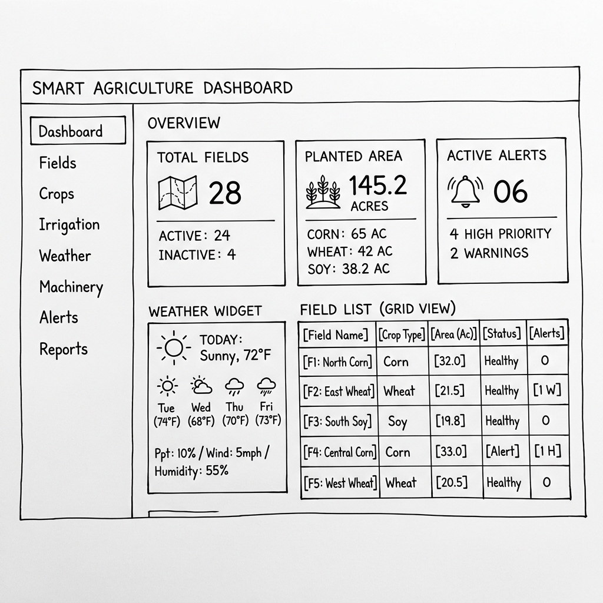
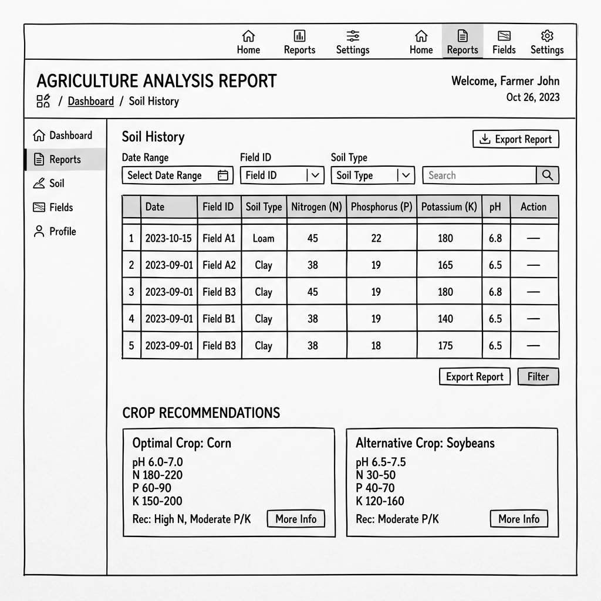
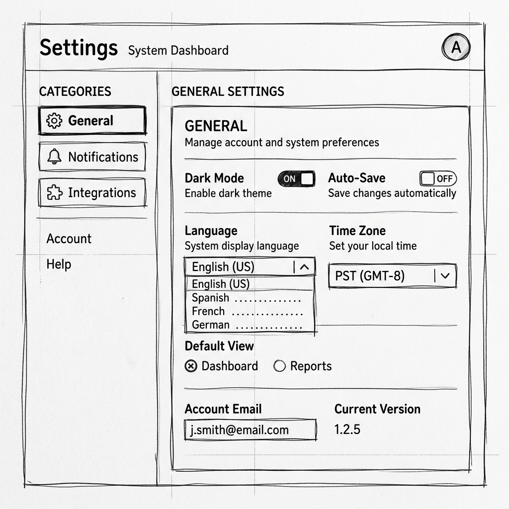

# Akıllı Tarım Yönetim Sistemi - Arayüz Wireframe Tasarımları ve Kod İncelemesi

Kullanıcı deneyimini (UX) merkeze alarak tasarlanan düşük çözünürlüklü (low-fidelity) prototipleri aşağıda inceleyebilirsiniz. Ayrıca projenin mevcut kod tabanı incelenerek, ilgili sayfaların arka planda zaten uygulanmış olduğu tespit edilmiştir.

## 1. Düşük Çözünürlüklü Wireframe Prototipleri

````carousel

<!-- slide -->

<!-- slide -->

````

## 2. Proje Kod İncelemesi (Code Review)

Proje dizinini (`backend/templates/`) detaylı bir şekilde inceledim. İstenen "Veri Görüntüleme", "Analiz Raporları" ve "Sistem Ayarları" ekranlarının kodlarının **zaten yazılmış olduğunu** tespit ettim:

> [!NOTE]
> Projedeki mevcut kod durumu:
> - **Gösterge Paneli (Veri Görüntüleme):** `backend/templates/dashboard/index.html` sayfasında; toplam tarla, ekili alan, aktif uyarılar ve hava durumu gibi widget'lar Bootstrap 5 kullanılarak modern bir yapıda tasarlanmış.
> - **Analiz Raporları:** `backend/templates/analysis/history.html` ve `backend/templates/analysis/result.html` dosyalarında; toprağın N, P, K değerleri ile ML modelinin ürün önerileri tablo formatında sunulacak şekilde hazırlanmış.
> - **Sistem Ayarları:** `backend/templates/dashboard/settings.html` dosyasında; genel ayarlar, bildirimler, entegrasyonlar (OpenWeatherMap vb.) ve fatura bilgileri sekme (tab) yapısıyla harika bir UX ile kodlanmış.

> [!TIP]
> **Sonuç:** Frontend kısmındaki temel iskelet (şablon kodları) eksiksiz olarak `templates/` klasöründe yer aldığından bu aşamada **yeni bir kod yazımına gerek kalmamıştır.** Yukarıdaki wireframe'ler, mevcut HTML mimarisinin görsel bir prototipi niteliğindedir. İstediğiniz ekstra bir tasarım değişikliği varsa, CSS veya şablonlara doğrudan ekleyebilirim.
