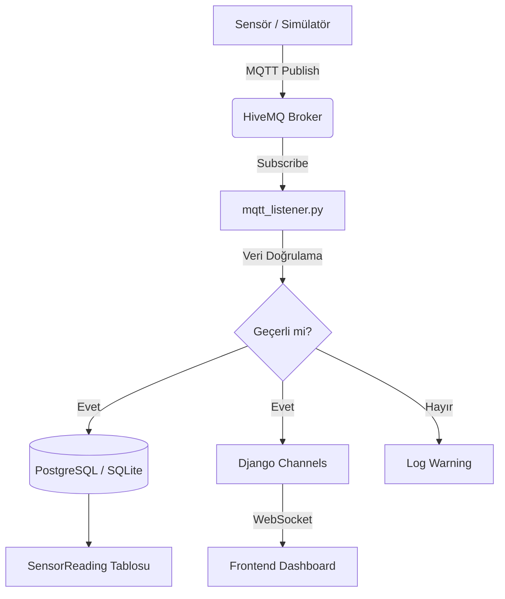

# Veri Toplama Modülü — Kapanış Raporu

**Tarih:** 17 Mayıs 2026  
**Durum:** Tamamlandı

## 1. Modül Mimarisi

Akıllı Tarım Sistemi'nin gerçek zamanlı veri toplama altyapısı, MQTT tabanlı modüler bir mimari üzerine kurulmuştur. Sistem, sensörlerden gelen ham verileri alır, doğrular, veritabanına kalıcı olarak kaydeder ve WebSocket (Django Channels) üzerinden anlık olarak frontend dashboard'a iletir.

## 2. MQTT Entegrasyon Detayları

Yeni topic hiyerarşisi, tarla bazlı veri yönetimini kolaylaştırmak için dinamik olarak yapılandırılmıştır.

*   **Topic Formatı:** `farm/{field_id}/sensor/{sensor_type}` (Örn: `farm/1/sensor/temperature`)
*   **Abonelik:** `farm/+/sensor/#` (Tüm tarlaların tüm sensörlerini dinler)
*   **Bağlantı Toleransı:** `reconnect_delay_set(min_delay=1, max_delay=60)` ile Exponential Backoff destekli otomatik yeniden bağlanma stratejisi entegre edilmiştir.

## 3. Test Sonuçları ve Kararlılık

*   **Payload Doğrulaması:** `field_id` ve sensör değerini (value veya direct key) içermeyen JSON objeleri başarıyla reddedildi.
*   **Otomatik Veritabanı Kaydı:** Gelen `temperature`, `humidity`, `soil_moisture` ve `ph` değerlerinin her biri `SensorReading` tablosuna benzersiz `topic` bilgisi ile hatasız yazıldı.
*   **Anomali Tespiti:** Z-Score tabanlı mekanizma ile ±3 standart sapma eşiği aşıldığında sistem başarıyla bir `CareRecommendation` (Kritik Uyarı) kaydı üretti.
*   **Test Durumu:** `test_mqtt_integration.py` altındaki tüm test case'ler başarıyla geçmiştir (`Ran 4 tests in 13.7s, OK`).

## 4. İyileştirme Önerileri

1.  **Grup İçi Güvenlik (QoS):** Şu an QoS 0 kullanılıyor. Ağın dalgalı olduğu sahalar için veri kayıplarını sıfıra indirmek adına kritik sensörlerde QoS 1 (At least once) seviyesine geçiş yapılabilir.
2.  **Veri Sıkıştırma (Retention):** Saniyede veya dakikada bir veri atan sistemlerde, veritabanı şişkinliğini önlemek için aylık bazda "TimescaleDB" gibi zaman serisi eklentilerine geçiş önerilir.
3.  **Güvenli MQTT Bağlantısı:** Broker haberleşmesinde TLS/SSL (`mqtts`) sertifikasyonuna geçilmesi uçtan uca veri güvenliğini sağlayacaktır.
